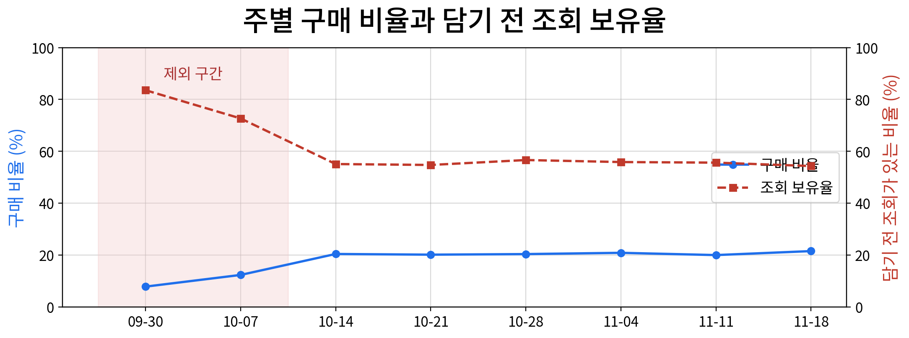
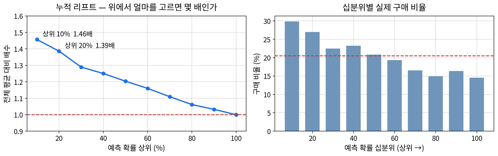
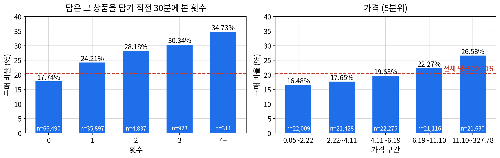

# 화장품 쇼핑몰 장바구니 7일 전환 분석

장바구니에 담는 **그 시점에 알 수 있는 정보만으로** "담은 그 상품을 7일 안에 샀는가"를 분류하고,
어떤 조건이 구매와 연결되는지, 그리고 예측력이 왜 이 정도에 그쳤는지를 데이터로 확인한 프로젝트입니다.

| 기간 | 팀 | 모형 | 데이터 |
|---|---|---|---|
| 2026.09 (2주) | 2인 (이슬기 · 배지환) | 로지스틱 회귀 (트리 6종과 비교) | Kaggle 화장품 쇼핑몰 행동 로그 874만 건 |

📄 **최종 보고서** — [`docs/0928_이슬기_배지환_장바구니전환분석_최종보고서.pdf`](docs/0928_이슬기_배지환_장바구니전환분석_최종보고서.pdf)

---

## 요약

행동 로그 874만 행을 고객 **108,458명**(1행 = 고객 1명)으로 바꿨고, 이 중 22,236명(**20.50%**)이 담은 상품을 7일 안에 구매했습니다.

| | |
|---|---|
| **판별력** | ROC-AUC **0.5841** (95% 구간 0.575 ~ 0.594) · 예측 상위 10%의 구매 비율 29.86%로 전체 평균의 **1.46배** |
| **일반화** | 과적합 없음 (학습 0.5915 · 교차검증 0.5900 · 검증 0.5841). 더 유연한 부스팅도 +0.0128에 그쳐, **모형이 단순해서가 아니라 신호가 약해서**로 판정 |
| **기여 1위** | 담은 그 상품을 **담기 직전 30분 안에 본 횟수** (표준화 계수 +0.280, 2위의 1.8배) |
| **결론** | 개별 고객의 구매 여부를 판정하는 용도로는 쓸 수 없다. 다만 **어느 장바구니를 먼저 볼지 순위를 매기는 데에는** 쓸 수 있다 |

> **판별력이 낮게 나온 배경** — 담기 직전 30분에 아무것도 보지 않은 고객이 <b>44.7%</b>, 담은 그 상품을 보지 않은 고객이 <b>61.3%</b>입니다.
> 핵심 신호가 절반 가까운 고객에게는 아예 없고, 조회 변수 2개만 쓴 모형(0.5613)과 가격 · 브랜드만 쓴 모형(0.5619)의 판별력이 사실상 같습니다.

---

## 데이터

- **출처** — [eCommerce Events History in Cosmetics Shop](https://www.kaggle.com/datasets/mkechinov/ecommerce-events-history-in-cosmetics-shop) (REES46 Marketing Platform, Kaggle) 중 `2019-Oct.csv` · `2019-Nov.csv` (전체 5개 중 2개)
- **규모** — 8,738,120행 × 9열, 2019-10-01 ~ 2019-11-30 (한 행 = "누가 · 언제 · 어떤 상품에 · 무엇을 했다")
- **품질 점검**
  - 중복: 고객 · 상품 · 행동 · 시각 네 컬럼 기준으로 461,449행 제거
  - 가격 0 이하 17,512행(0.212%) 제외 → **8,259,159행**
  - 시각 UTC → UTC+3 보정 (활동 최저 새벽 1시 → 4시, 최고 저녁 7시 → 밤 10시)
  - 품목 이름은 98.32% 결측이라 사용하지 않고, 브랜드 결측 41.69%는 '미상' 범주로 유지
- **분석 단위** — `user_session`은 세션 간격 1분 미만이 33.0%, 최장 60.7일이라 "한 번의 방문"으로 쓸 수 없었습니다. 대신 **고객 · 상품 · 담기 직전 30분**으로 직접 정의했습니다.

---

## 핵심 결정 3가지

**① 목표변수를 "담은 그 상품의 7일 내 구매"로 한정** — 미구매 86,222명 중 7일 안에 다른 상품을 산 고객은 7.49%이고, 92.51%는 아무것도 사지 않았습니다. 그래서 결론에서는 "사지 않았다"가 아니라 "**담은 그 상품을** 사지 않았다"로 씁니다. 7일 내 구매자 22,236명 중 63.57%가 담은 지 1시간 안에, 94.59%가 3일 안에 샀습니다.

**② 관측 초기 구간 제외 — 조회와 구매의 관계가 뒤집혀 있었습니다.** 데이터가 10월 1일에 시작해 그 이전 활동이 보이지 않으므로, 초기에 "최초 담기"로 잡히는 고객 상당수는 실제로는 최초가 아닙니다. 경계는 **목표변수와 무관한 기준**(일별 첫 담기 인원이 평상시 수준으로 내려오는 첫날, 2019-10-11)으로 먼저 정했고, 사후 확인에서 주별 구매 비율과 담기 전 조회 보유율이 함께 안정되는 것을 확인했습니다.

| 담기 전 조회 횟수 | 0회 | 1회 | 2회 | 11회 이상 |
|---|---|---|---|---|
| 제외 전 구매 비율 | 18.87% | **10.13%** | 22.43% | 26.49% |
| 제외 후 구매 비율 | 18.54% | 21.67% | 22.66% | 25.71% |



**③ 트리가 더 높지만 로지스틱 회귀로 확정** — 트리 6종을 같은 분할 · 같은 변수로 비교했습니다(하이퍼파라미터 탐색 없음). 최고인 LightGBM의 ΔAUC **+0.0128**이 사전에 정한 기준 0.02에 못 미쳤습니다. 예측만이 목적이라면 부스팅이 낫지만(상위 5% 리프트 1.534 → 1.679), 이 분석은 **계수와 오즈비를 읽는 것**이 목적이라 로지스틱을 택했습니다.

---

## 결과

### 판별력 — 개별 판정은 불가, 순위 선별은 가능

예측 확률 순으로 상위 10%를 고르면 구매 비율이 29.86%로 전체 평균(20.50%)의 1.46배가 됩니다. 다만 그 상위 10% 안에서도 70.1%는 사지 않습니다.



### 무엇이 구매와 연결되는가 (표준화 계수 상위 4항)

| 순위 | 조건 | 표준화 계수 | 오즈비 (95% 구간) |
|---|---|---|---|
| 1 | 담은 그 상품을 몇 번 보았는가 | +0.280 | 2.06 (1.90 ~ 2.22) |
| 2 | 가격이 얼마인가 (로그) | +0.152 | 1.14 (1.13 ~ 1.16) |
| 3 | 오후에 담았는가 (심야 대비) | +0.110 | 1.26 (1.18 ~ 1.34) |
| 4 | 그 밖의 조회를 얼마나 했는가 | −0.109 | 0.84 (0.80 ~ 0.88) |

28개 항 중 19개가 유의하지만, 관측치가 8만 명대라 아주 작은 계수도 유의해지므로 실질적으로 읽을 수 있는 항은 이 넷입니다.



**전체 조회량은 혼자 볼 때와 모형 안에서 방향이 반대입니다.** 전체 조회수 안에 "그 상품 조회수"가 들어 있어(포함 100%, Spearman 0.688), 그 상품 조회를 고정하면 전체 조회수에 남는 것은 "다른 상품을 둘러본 양"이 됩니다.

| 담기 직전 전체 조회 | 0회 | 1회 | 2회 |
|---|---|---|---|
| 실제 구매 비율 | 18.54% | 21.67% | 22.66% |
| 모형 안 확률 (그 상품 조회 0회 고정) | 18.33% | 16.14% | 15.58% |

### 시사점

- 담은 그 상품을 **2회 이상 본** 고객의 구매 비율은 **28.84%**(6,071명, 전체의 5.6%)입니다 → 담기 직전 반복 조회를 개입 신호로 쓸 수 있습니다.
- 그 상품 조회를 같게 놓으면 약 3회까지는 **전체 조회량이 많을수록 덜 전환**됩니다 → "많이 둘러본 고객"을 그 범위에서는 유망 신호로 쓰지 않습니다.
- 구매의 63.57%가 1시간 안에 일어나므로 **개입은 담기 직후**여야 합니다. 1시간 뒤에도 사지 않은 고객만으로 다시 재면 상위 10% 배수가 1.46배 → **1.20배**로 떨어집니다.
- 이 모형은 구매 가능성을 찾는 모형이지 개입 효과를 찾는 모형이 아닙니다. 그래서 담기 직후 할인이 아니라 **비금전적 안내**(재고 · 배송 정보)로 한정하고, 실제 효과는 별도 실험으로 확인해야 합니다.

---

## 역할 분담과 검증

- **이슬기** — 목표변수 생성, 조회 변수 단변량 · 이변량 분석
- **배지환** — 분석 대상 · 설명변수 생성, 상품 · 상황 변수 단변량 · 이변량 분석
- 다변량 · 변수 선택은 함께 진행

**목표변수는 세 층으로 검증했습니다** — 수기 대조 20명(규칙 해석의 오류) · 정합성 검증 7종(값과 관계의 어긋남) · 전수 재계산 108,458명(코드가 규칙대로 돌지 않은 경우). 설명변수를 만든 사람과 수기 대조를 한 사람은 다르게 두었습니다.

**판정 기준은 결과를 보기 전에 정했습니다** — 주 지표(ROC-AUC), 기준값 선정(학습용에서만 F1 최대), 과적합 · 과소적합 판정선, 트리 비교 기준(ΔAUC 0.02) 등 7개 항목.

## 한계 (주요 항목)

- 다른 상품을 산 고객(미구매 86,222명 중 7.49%)과 7일을 넘겨 산 고객(결국 구매한 24,109명 중 1,873명, 7.77%)이 미구매로 기록됩니다.
- 시간대 보정(UTC+3)과 관측 초기 제외 경계는 데이터 모양으로 판단한 값입니다.
- 검증용이 같은 기간의 무작위 분할이라 다른 기간에도 성능이 유지되는지는 확인하지 않았습니다.
- 관측 데이터이므로 "영향을 미친다"가 아니라 "**전환을 예고한다**"로 해석합니다.
- 전체 13가지는 최종 보고서 「결론 — 한계」에 있습니다.

---

## 노트북 구성

| 번호 | 노트북 | 내용 |
|---|---|---|
| 01 | 데이터품질점검 | 자료형 · 시간대 보정 · 중복 정리 · 가격 0 이하 제외 |
| 02 | 전제검증 | `user_id`가 사람 단위인지, `user_session`이 한 번의 방문인지 확인 |
| 03 | 분석대상테이블 | 행동 로그 → 고객 단위 테이블 |
| 04 | 설명변수생성 | 담기 직전 30분 조회 변수 · 시간대 · 요일 |
| 05 | 목표변수생성 | `purchase_7d` |
| 06 | 범주묶기기준 | 브랜드 · 품목 '기타' 묶기 기준을 결과 보기 전에 확정 |
| 07 | 번인진단 | 관측 초기 구간 진단 |
| 08 | 마스터테이블 | X · Y 결합, 범주 묶기 적용 → 108,458행 |
| 09 | 단변량 (A조 · B조 · 통합) | 조회 변수 / 상품 · 상황 변수 |
| 10 | 이변량 (a · b) | Mann-Whitney U · 교차분석 · 효과크기 |
| 11 | 다변량 · 변수선택 | 변수 8개 → 6개, 분산팽창계수 최대 20.218 → 1.249 |
| 12 | 모델링용 전처리 | 층화 분할 · 로그 변환 · 기준 범주 지정 · 더미 인코딩 |
| 13 | 모델구축 · 가정검정 | 로지스틱 회귀 · Box-Tidwell · 곡선 항 처방 · 민감도 대조 |
| 14 | 교차검증 · 트리비교 · 해석 | 5-fold 교차검증 · 트리 6종 비교 · 표준화 계수 · 오즈비 |
| 15 | 보고서 그림 | 보고서용 그림 생성 (새 분석 없음) |

## 폴더 구조와 실행 방법

```
cosmetics-cart-conversion/
├── notebooks/        # 01 ~ 15 (순서대로 실행)
├── docs/
│   ├── figures/      # 보고서 그림 (15번 노트북에서 생성)
│   └── 0928_...최종보고서.pdf
├── data/             # (직접 준비) Kaggle 원본 CSV
├── output/           # (실행 시 생성) 중간 산출물
└── helpers/          # (비공개) 수업 실습 모듈
```

1. Kaggle에서 `2019-Oct.csv` · `2019-Nov.csv`를 내려받아 `data/2019-Oct.csv/2019-Oct.csv` 형태로 둡니다.
2. `notebooks/` 폴더 안에서 노트북을 열면 상위 폴더를 프로젝트 폴더로 인식합니다.
3. 노트북은 수업에서 제공된 실습 모듈 `helpers`를 사용합니다. **이 모듈은 공개하지 않으므로** 저장소만으로는 다시 실행되지 않으며, 실행 결과는 노트북에 그대로 남겨 두었습니다.
4. 경로는 Windows 표기(`\`)를 사용합니다.

**도구** — Python 3 · Jupyter Notebook · pandas · numpy · statsmodels · scipy · scikit-learn · xgboost · lightgbm · catboost · matplotlib · seaborn
